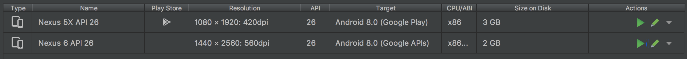
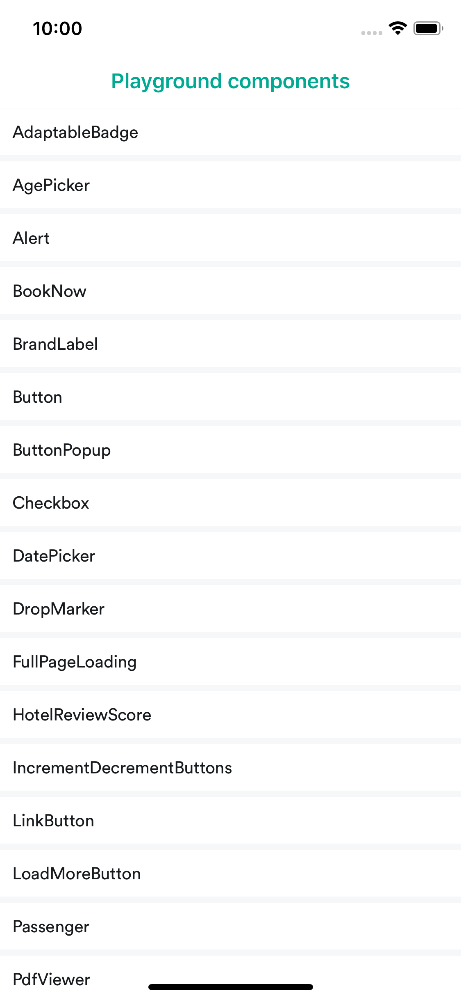

[](https://circleci.com/gh/kiwicom/mobile)

This is not an actual mobile application. This repository contains only React Native (RN) parts of the project. These parts are being used in the original (private) native code. However, you can still run this application to see these parts in the pure React Native.

## Table of Contents

* [Installation and Run](#installation-and-run)
* [Testing](#testing)
* [Building](#building)
  * [Fastline installation](#fastline-installation)
  * [Fastline run instructions](#fastline-run-instructions)
* [Environment](#environment)
* [Project structure](#project-structure)
* [Native modules](#native-modules)
  * [Adding a new native module](#adding-a-new-native-module)
  * [Logging module](#logging-module)
  * [Translation module](#translation-module)
  * [Color module](#color-module)
  * [Currency module](#currency-module)
* [Best practices](#best-practices)
  * [Accessing arbitrarily nested, possibly nullable properties on a JavaScript object](#accessing-arbitrarily-nested-possibly-nullable-properties-on-a-javascript-object)
  * [Error handling](#error-handling)
  * [Working with Playground](#working-with-playground)
  * [Working with GraphQL API](#working-with-graphql-api)
  * [Working with translations](#working-with-translations)
  * [Upgrading dependencies](#upgrading-dependencies)
* [e2e testing](#e2e-testing)
  * [Android](#android)
  * [ios](#ios)

## Installation and Run

> Note: we currently support *only* macOS. It is however possible to run the Android application under Linux by tweaking the file `android/app/build.gradle` like in this [commit](https://github.com/kiwicom/mobile/pull/709/commits/68502a93fca7057400a562e701a98afc88214dc8).

All necessary information are described in the official [React Native documentation](http://facebook.github.io/react-native/docs/getting-started.html#installing-dependencies). Basically you need to install macOS dependencies:

```
brew install node watchman yarn
gem install cocoapods
```

Install Xcode and Android Studio. After that clone this repository and install all the necessary dependencies:

```
git clone git@github.com:kiwicom/mobile.git
cd mobile
yarn install
cd ios; pod install
```

And if you have Xcode already installed - just run `yarn ios`. It should open iPhone emulator with our application. 

It's also possible to open other devices from command line to test tablets for example:

```
xcrun simctl list devices
yarn ios --simulator="iPad Pro (10.5-inch)"
```

Similarly for Android (`yarn android`) but you have to open Android emulator first.

You need to make sure that your Android emulator image supports Google Play Store. [Look for this symbol](https://stackoverflow.com/a/43197403/3135248):



Moreover, make sure you have a valid [personal Gitlab token](https://gitlab.skypicker.com/profile/personal_access_tokens)
and set it as your environment variable:

```bash
export RNKIWIMOBILE_DEPLOYMENT_TOKEN="YOUR_TOKEN_HERE"
```

## Testing

You will usually need only this during development:

```
yarn test
yarn test --watch
```

You can also run tests without all the verbose messages produced by console.(log|warn|error) as such:

```
yarn test --silent
```

It's good idea to run the whole test-set using this command:

```
yarn test-ci
```

It basically consists of code linting, type checking, complete testing and GraphQL schema validation. You can find more possibilities by running `yarn run`.

## Building

We use Fastlane as a tool for building, codesigning and uploading to App Store, Google Play and beta testing environments. If you want to build just a JS bundle files simply run following command:

```
yarn build
```

You'll then find output files in the `.build` directory (for Android and iOS).

### Fastlane installation

You need to do several steps in order to be able to deploy and build this application:

- [install Fastlane](https://docs.fastlane.tools/#getting-started)
- setup environment variables: create `ios/fastline/.env` file with `APPLE_ID=your@apple.id`
- clone private `react-native-app-certificates` repository with all necessary keys (ask `Trond Bergquist` or `Martin Zlamal` for access)
- copy the `kiwi-rn-hotels.keystore` file into `android/app` directory 
- create a new password in the Keychain Access app (macOS) with name `android_keystore` and account name `rn_hotels` (the password is stored in the Vault - see [Environment](#environment))
- double click the `dist_cert.p12` file (password can be found in the Vault)

### Fastlane run instructions

In order to build and deploy this project to the TestFlight just navigate to the `ios` folder and run `fastlane beta`. Alternatively from root directory:

```
( cd ios ; fastlane beta )
```

This new build has to be distributed to the (external) testers. To do so just go to iTunes Connect, select the right application > TestFlight > iOS builds > select build number > Groups (+) > select the group of testers > next, next, next...

On android, navigate to the android folder and run `fastlane beta`. Alternatively from root directory:

```
( cd android ; fastlane beta )
```

The newly build apk will be found in `android/app/build/outputs/apk/app-release.apk`

## Environment

All sensitive environment variables are stored in `.env` file. You should setup these variables if you want 100% of all functions.

**Information for Kiwi.com employees:** all environment variables are shared using [Vault](https://www.vaultproject.io/). Ask your colleagues how to get them. You'll first need VPN, secret key (token) and Vault namespace.

## Project structure

This project uses [Yarn workspaces](https://yarnpkg.com/lang/en/docs/workspaces/) so the root directory is actually so called "workspace root". Workspace root is responsible for handling this repository (especially testing). You can find all sources inside of the `app` directory. Each directory inside `app` should be treated as separate NPM package and you **should not** reuse code from each other via `import` statements. If you need to use one package inside of other package (this should be very common use-case) please require it in `package.json` file (see `app/core/package.json`).

```
.
├── .circleci/                  - CI configuration
├── .github/                    - GitHub templates (for PR, issues, contributing)
├── android/                    - native code for Android
├── app/
│   │── core/                   - core application (not distributed)
│   ├── hotels/                 - Hotels application (distributed)
│   ├── MMB/                    - Manage My Booking application (distributed)
├── ios/                        - native code for iOS
├── packages/                   - Yarn workspaces
│   ├── accessibility/          - @kiwicom/mobile-accessibility
│   ├── config/                 - @kiwicom/mobile-config
│   ├── navigation/             - @kiwicom/mobile-navigation
│   ├── relay/                  - @kiwicom/mobile-relay
│   ├──  ...
│   └── shared/                 - @kiwicom/mobile-shared
├── scripts/                    - support scripts for the whole monorepo
└── schema.graphql              - GraphQL schema of the backend server
```

In case you need additional dependency for the package, you should add it to the `package.json` of the workspace (for example `app/hotels/package.json`). Root `package.json` is only for global dependencies related to the whole monorepo (testing tools, linters and so on).

## Native modules

The native developers have prepared some native modules that we can use in our code. They are available through an npm package called `@kiwicom/react-native-native-modules`

### Adding a new native module

- Navigate to `app/shared/package.json` and bump the version to latest version.
- Navigate to `ios/Podfile` and add the new package like this:
  - `pod 'RNLogging', :path => '../node_modules/@kiwicom/react-native-native-modules'`
- Run `yarn pod-install`
- Navigate to `android/app/src/main/java/com/reactnativeapp/MainApplication.java` and add the new package to the `getPackages` method, `new RNLoggingPackage()`

### Logging module

It exposes two methods 
- ancillaryDisplayed
- ancillaryPurchased

And 4 types:

```js
const Type = {
  ANCILLARY_STEP_DETAILS,
  ANCILLARY_STEP_PAYMENT,
  ANCILLARY_STEP_RESULTS,
  ANCILLARY_STEP_SEARCH_FORM,
};
```

Usage:

```js
import { Logger } from '@kiwicom/mobile-shared';

Logger.ancillaryDisplayed(
  Logger.type.ANCILLARY_STEP_DETAILS,
  Logger.Provider.ANCILLARY_PROVIDER_BOOKINGCOM
  );
Logger.ancillaryPurchased(
  Logger.type.ANCILLARY_STEP_RESULTS,
  Logger.Provider.ANCILLARY_PROVIDER_BOOKINGCOM
  );
```

### Translation module

It exposes one method
- translate

Usage:

```js
import { Translate } from '@kiwicom/mobile-shared';

const someString = Translate('translation.key.to.translate');
```

### Currency module

It exposes one method
- formatAmount

Usage:

```js
import { CurrencyFormatter } from '@kiwicom/mobile-shared';

const priceInEuros = 500.34;
const currencyCode = 'NOK';
const priceInNOK = CurrencyFormatter(priceInEuros, currencyCode);
```

## Best practices

### Accessing arbitrarily nested, possibly nullable properties on a JavaScript object

Sometimes (especially in GraphQL environment with nullable results) it's necessary to access deeply nested objects in order to get the value. However the path may contain nullable fields and therefore it's necessary to do checks like this:

```js
props.user &&
props.user.friends &&
props.user.friends[0] &&
props.user.friends[0].friends
```

But that's not very friendly and this is why we have `optional chaining` . You can use it like this:

```js

const friends = props.user?.friends?.[0]?.friends;
```

**Do not use `_.get(...)` from Lodash!**

### Error handling

Error handling is complicated in general - especially in GraphQL environment. There are several scenarios that may occur:

1. GraphQL API returns `data` field and no `errors`

This should be considered as a valid full response and there should not be any errors. There may be nullable fields, however.

2. GraphQL API returns `data = null` and `errors` field

This is fatal error. Server was not able to get data and it's probably not operating correctly. It's like equivalent of total GraphQL server error (500). We should display full page error (`GeneralError` component).

3. GraphQL API returns `data` but also `errors` field

Most common scenario (somewhere between). In this case we are able to fetch at least something but it failed partially so there are errors and we can expect some nullable fields. This may be just missing prices but also completely missing data. It's very different to point 2.

We are showing little warning in this case. How to handle nullable fields really depends on the situation. Sometimes it's OK to leave it empty instead of for example hotel rating (★★★), sometimes it's necessary to display error message or sad picture in case of completely missing hotels. It depends. We are always trying to render as much as possible.

### Working with Playground

There is so called Playground for easier development. It's our custom WIP replacement for Storybook. The idea is to write regular component tests with ability to see them in the Playground. Therefore you need to write only the tests and you don't have to maintain additional stories. Example of simple test:

```js
it('Works!', () => {
  PlaygroundRenderer.render(<AdaptableBadge text="default badge" />);
  PlaygroundRenderer.render(<AdaptableBadge text="badge with color" color="red" />);
});
```

The `PlaygroundRenderer` allows you to see the tests in the Playground and it automatically creates shallow snapshots of the component. 

To start the Playground, you need to switch which `App` is imported in the `index.js` file at the root of this repository. Comment the line importing the file `app/App` and uncomment the following line, which imports `packages/playground/src/Navigation`. That means you should now see 

```js
//import App from './app/App';
import App from './packages/playground/src/Navigation';
```

in `index.js`. Start the app like you would normally do, i.e. by running `yarn ios`, and you should see the following screen:



### Working with GraphQL API

This application uses GraphQL API as a data source. You can find GraphQL schema in `schema.graphql` file. This schema is used by Relay Compiler and Relay Babel plugin to generate and validate queries for backend server. GraphQL API itself is evolving over time so you may need to update our snapshot. You can do it easily using this command:

```
yarn graphql
```

Additional useful tools:

- https://kiwi-graphiql.now.sh/ (introspection and docs)
- https://kiwi-graphql-voyager.now.sh/ (graphical visualisation)

### Working with translations

Current implementation is little bit dodgy because we have to use native code (requirement from native team). The underlying implementation is basically this:

```swift
- (NSString *)translate:(NSString *)key {
    return key;
}
```

So it returns key back. However, this happens only in development environment and it should return real translation in production (we cannot test or use it in development). For this reason we have custom fallback vocabulary and we touch this repository if underlying code returns unchanged key.

You always have to use the following component:

```js
<Translation id="Core.Authentication.Login" />
```

These components should be enforced everywhere we need to use translations (button titles, children of the `Text` component). However, there are situations where we need to use the translation (because of the enforcement) but there is nothing to translate. In this case just use the `passThrough` property instead of `id`:

```js
<Translation passThrough="★★★★★" />
```

It comply with the translations interface but it returns the property value directly back without even trying to translate it.

There are also situations where we need to return multiple translations but this is little bit more tricky because it's not possible to nest (or concat) multiple translations. You can use `TranslationFragment` component for this:

```js
<TranslationFragment>
  <Translation passThrough="★★★★★" />
  <Translation id="SingleHotel.Rating.Stars" />
</TranslationFragment>
```

This fragment also comply with Flow types and it has similar behaviour with `React.Fragment` from React 16.2+...

#### PhraseApp

We use [PhraseApp](https://phraseapp.com/) for managing translations. All keys and relevant screenshots are deployed automatically (the deployment script must be executed manually though):

```
yarn deploy-translations
```

`PHRASE_APP_PROJECT_ID` and `PHRASE_APP_TOKEN` should be added to `~/.bash_profile`

_(we need to improve it - this is just PoC)_

How to create screenshots? Open iOS simulator and press `Ctrl+S` (save). It will save the screenshot of current page so you can work with it later. It's usually good idea to mark where is the translated string on the screen. You should convert your new screenshots to JPG to make them smaller before commiting them to the Git (macOS):

```
mkdir jpegs
sips --resampleHeightWidthMax 640 --setProperty format jpeg ./*.png --out jpegs
```

We use [Git LFS](https://git-lfs.github.com/) for storing these images. You can read even more about it [here](https://github.com/git-lfs/git-lfs/wiki/Tutorial).

### Upgrading dependencies

Check all dependencies with `outdated` Yarn command. This will tell you how behind we actually are. Try not to upgrade everything at once since there may be breaking changes (even though it's non-breaking upgrade). The second command will help you significantly with upgrading these dependencies across our workspace repository:

```
yarn outdated
yarn upgrade-interactive --latest
```

## E2e testing

We use [detox](https://github.com/wix/Detox) for e2e testing. 
Note: One of our tests `imageGallery.spec.js` might fail depending on device. See comment in that file.

### Android

Detox is currently stable for android on RN-versions <=0.56. It runs on android, but there might be some quirks. 
To run, first create an emulator in Android Studio with the name `e2e_emulator`. Then you can run `yarn e2e-aphone`.
Because we have an absoulutely positioned close button on the bottom of the detail view, android will click
this button when trying to scroll. You might want to comment line 34 in `BookingSummary.js`

### ios

ios should work just fine. Just do `e2e-iphone` or `e2e-ipad` to run the tests