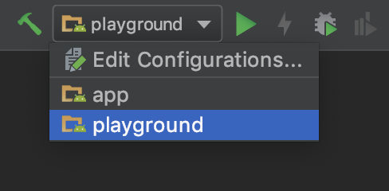
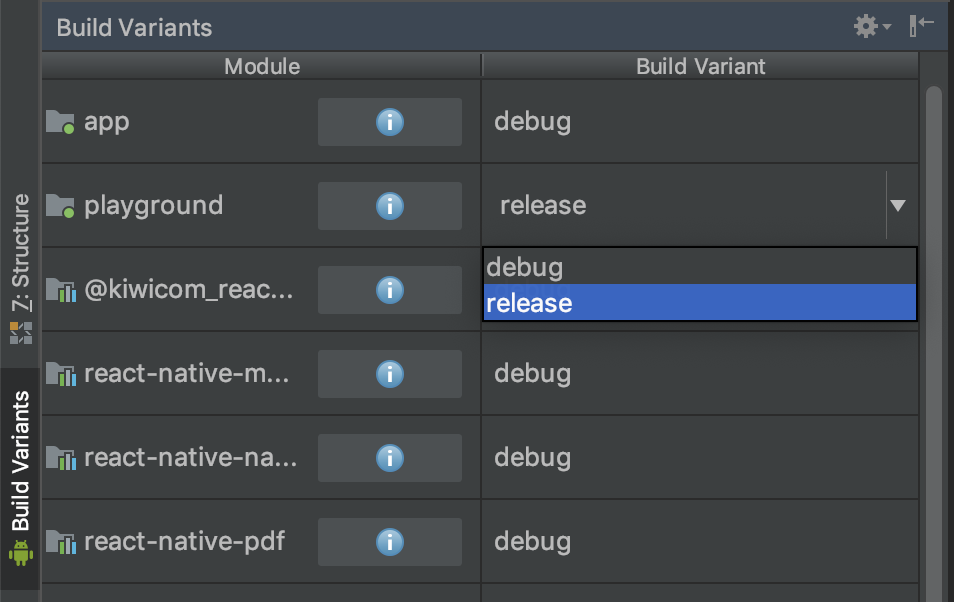

# rnkiwimobile - Android distribution

The source code can be found in [rnkiwimobile](../../android/rnkiwimobile). This library contains everything that the Android Kiwi native app needs in order to run React Native including the JavaScript code.

## Test playground app

You can run the `playground` inside the `android` directory using Android Studio. 
Open Android Studio and use the dropdown on the top-right corner and its play button.

### Debug

In debug mode, you will be running a local copy of `rnkiwimobile`. 
Furthermore, the packager will be used so you can reload your JavaScript instantly. 
Firstly we need to start the packager:

```bash
yarn start
```

Then just run the `playground` with Android Studio:




**Important**: The packager will only be used if there is no bundle in `.build/android`, if there is,
you can safely delete the whole directory.

### Release

In release mode, the `playground` is going to use `rnkiwimobile` from [Trinerdis](http://trinerdis.cz:8000/repository/snapshots/com/trinerdis/skypicker/rnkiwimobile/). The version is defined [here](../../.build/package.json#L3). 
You do not need the packager running. This is the real version that the native app wil be consuming. We need to open
Android Studio and change Build Variants to `release` for `playground` (this will force release mode on its dependencies):



## Usage in a real app

```
implementation "com.trinerdis.skypicker:rnkiwimobile:$rnKiwiMobileVersion-SNAPSHOT"
```
