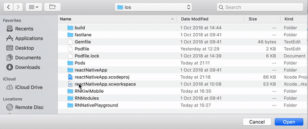
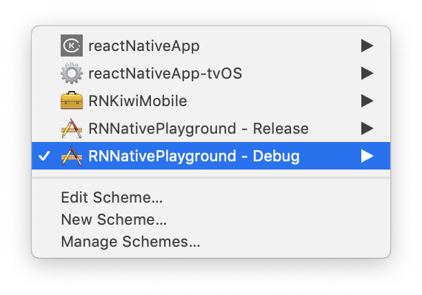

# iOS distribution

The source code can be found in [RNNativePlayground](https://github.com/kiwicom/mobile/tree/master/ios/RNNativePlayground)

## Test playground app

### Release

In release mode, the `playground` will be ran from `jsbundle`. You do not need the packager running. This is the real version that the native app will be consuming,

You can run it using:

```
yarn run ios --scheme RNNativePlayground --configuration Release
```

Or if you prefer you can run it from XCode. Open `reactNativeApp.xcworkspace` and then make sure you have `RNNativePlayground - Release` scheme selected before running.



### Debug

Running the app from the packager allows you to reload the Javascript code instantly, every time you make changes in your code.

You can run the playground app using:

```
yarn run ios --scheme RNNativePlayground --configuration Debug
```

Or if you prefer you can run it with XCode:

1. Change the schema for `RNNativePlayground - Debug`



2. Then run the packager from the root of this repo:

```bash
yarn start
```

_NOTE_: Clean build directory (⇧⌘K in XCode) if you are switching directly from `Debug` to `Release` schema.
