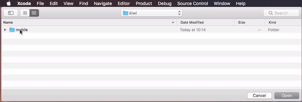

# iOS distribution

The source code can be found in [RNNativePlayground](https://github.com/kiwicom/mobile/tree/master/ios/RNNativePlayground)

## Test playground app

Open the project in XCode (use `reactNativeApp.xcworkspace`). Make sure you have `RNNativePlayground` scheme selected before running.



### Running from the packager

Running the app from the packager allows you to reload the Javascript code instantly, every time you make changes in your code.

1. To run `KiwiHotels` module with the packager, change [`RNKiwiConstants.m`](https://github.com/kiwicom/mobile/blob/master/ios/RNKiwiMobile/RNKiwiConstants.m) like follows:

```objc
+ (NSURL *)bundleURL {
  return [NSURL URLWithString:@"http://localhost:8081/app/native.bundle?platform=ios&dev=true"];
}
```

2. Then run the packager from the root of this repo:

```bash
yarn start
```
