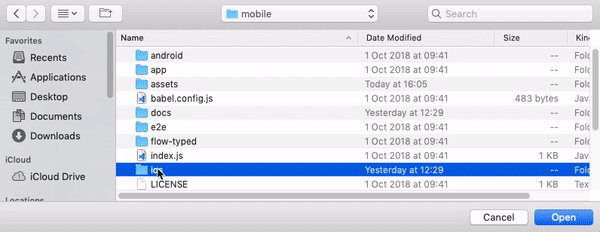
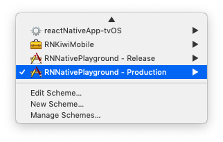

# iOS distribution

The source code can be found in [RNNativePlayground](https://github.com/kiwicom/mobile/tree/master/ios/RNNativePlayground)

## Test playground app

Open the project in XCode (use `reactNativeApp.xcworkspace`). Make sure you have `RNNativePlayground - Release` scheme selected before running. It will run the app from `jsbundle`.



### Running from the packager - production mode

Running the app from the packager allows you to reload the Javascript code instantly, every time you make changes in your code.

1. To run `KiwiHotels` module with the packager, change the schema for `RNNativePlayground - Production`



2. Then run the packager from the root of this repo:

```bash
yarn start
```
