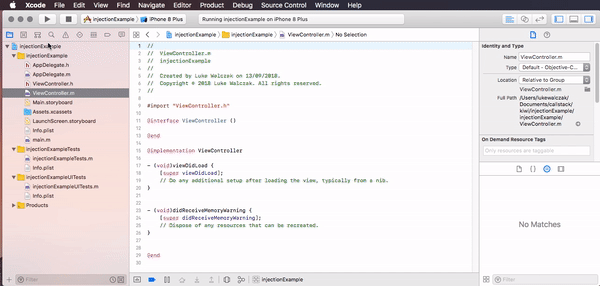
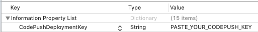
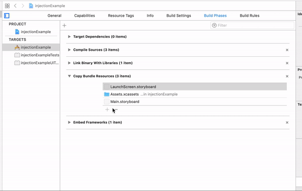
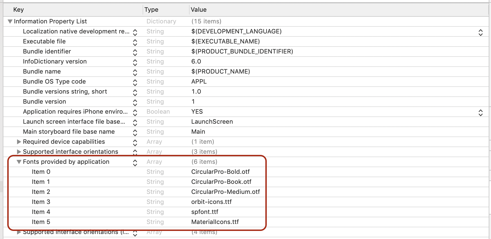

# React Native modules

## Creating a new React Native module

A React Native module is a set of standalone React Native views that act as a standalone application.

To create a new React Native module just:

1. Create a new folder inside `app` folder, eg: `app/newModule`, where `newModule` stands for the new module name.

2. Inside `newModule/index.js` export all standalone views.

## Using a React Native module in a playground

In the [`app/native`](https://github.com/kiwicom/mobile/blob/master/app/native.js) import all views from a module of your choice and register them by name thath you will later refer to form the native side.

```js
// Hotels
AppRegistry.registerComponent(
  'NewKiwiHotels',
  () => NewHotelsStandAlonePackage
);
```

The registered module has to be then instantiated along with the proper `moduleName` and the required `initialProperties` like below:

```objc
  RNKiwiViewController *vc = [[RNKiwiViewController alloc] initWithModule:@"NewKiwiHotels"
                                                          initialProperties:@{
                                                            @"language": @"en",
                                                            @"currency": @"EUR",
                                                            @"lastNavigationMode": @"present",
                                                            @"dimensions": [self windowDimensions],
                                                            @"checkin": todayDate,
                                                            @"checkout": tomorrowDate,
                                                            @"version": @"3.7.13-9d55ad66",
                                                            @"cityName": @"Barcelona",
                                                            @"cityId": @"aG90ZWxDaXR5Oi0zNzI0OTA=",
                                                            @"roomsConfiguration": @[
                                                                @{
                                                                  @"adultsCount": @1,
                                                                  @"children": @[
                                                                      @{
                                                                        @"age": @2
                                                                        }
                                                                      ]}
                                                                ]
                                                          }];
```

### CodePush in playground

To check codepush updates in `RNNativePlayground` follow the steps:

1. Create a file called `keys.xcconfig` within `RNKiwiMobile` and add there two keys:
 * `STAGING_KEY=""`
 * `RELEASE_KEY=""`

_NOTE_: That file is added to `.gitignore` which prevents from pushing those keys to github repository.

2. Open schema `RNNativePlayground - Staging` for `Staging` configuration or `RNNativePlayground - Release` for `Release` configuration.

## Using React Native module in external app

1. Inject `RNKiwiMobile.framework` in new XCode project to `Embedded Binaries`



2. Create a `ViewController` similar to the one existing in playground which contain:

- init with creating a bridge

```objc
[[RNKiwiSharedBridge sharedInstance] initBridge];
```

_NOTE_: Creating bridge upfront guarantees that your React Native module will be built once the application is launched.

- create a new instance of `RNKiwiViewController` with `moduleName` and `initialProperties`

- use methods required by an implemented protocols

```objc
# pragma mark - RNKiwiViewControllerFlowDelegate

- (void)RNKiwiViewControllerDidFinish:(nonnull RNKiwiViewController *)viewController {
  [self.navigationController popViewControllerAnimated:YES];
}

# pragma mark - RNKiwiCurrencyManager

- (NSString *)formattedPrice:(NSNumber *)price withCurrency:(NSString *)currencyCode {
  return [[price stringValue] stringByAppendingString:currencyCode];
}

#pragma mark - RNKiwiTranslationProvider

- (NSString *)localizedStringWithKey:(NSString *)key {
  // In real app it would give us the String based on localization
  return nil;
}

#pragma mark - UIGestureRecognizer

- (BOOL)gestureRecognizer:(UIGestureRecognizer *)gestureRecognizer shouldReceiveTouch:(UITouch *)touch {
  if (self.navigationController.interactivePopGestureRecognizer == gestureRecognizer) {
    return [_activeVc isInteractivePopGestureAllowed];
  }
  return YES;
}
```

### CodePush in external app

Once CodePush is integrated in framework it's necessary to set codepush key to receive updates. Choose one of the following options for configuring codepush key.

1. Add codepush key to `Info.plist`.



2. Initialize the bridge with codepush key.

```objc
[[RNKiwiSharedBridge sharedInstance] initBridgeWithCodePush:CODEPUSH_KEY];
```

### Using fonts from frameworks

Within the `RNKiwiMobile.framework` in folder `assets/fonts` you can find all the fonts which have to be added in new XCode project. Follow the steps below to add them:

1. Include fonts in your bundled resources within the Build Phases section



2. Add your fonts to `Info.plist`



## Bridge

There is only one bridge present throughout the lifecycle of the app.

```objc
- (void)initBridge {
  if (!_bridge) {
    _bridge = [[RCTBridge alloc] initWithBundleURL:[RNKiwiConstants bundleURL] moduleProvider:nil launchOptions:nil];
  }
}
```
